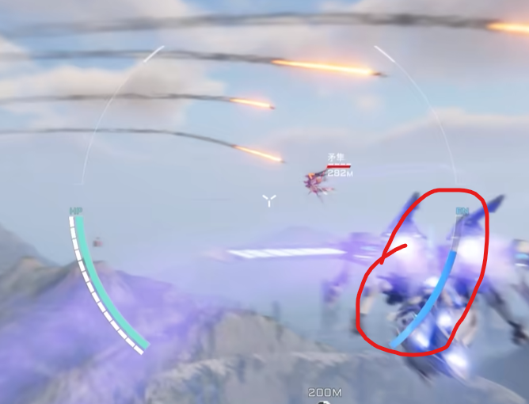
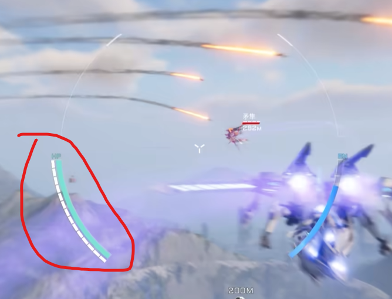
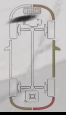
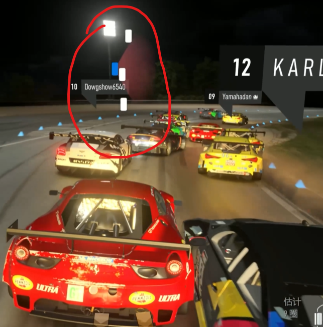
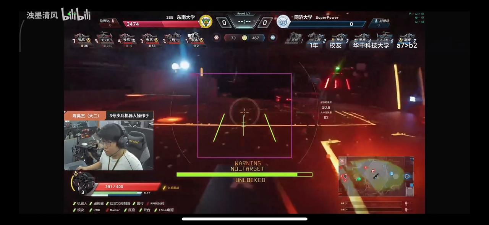
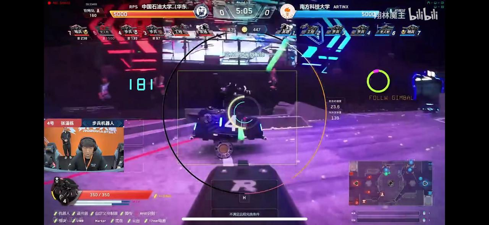

T0：原官方客户端功能均要能够实现，在此基础上进行客制化

可靠功能
1.通用功能
1. 自瞄状态（自瞄是否在线、是否瞄准到目标-3个状态）
2. 超级电容状态（类似于体力条）
3. 官方总能量限制状态
4. 血量（包括对方血量）
5. 发弹量
6. 热量限制
7. buff效果计算（剩余时间和具体增益）
8. 计算对面复活时间 （具体的复活时间 ）买活要的钱
9. 电机、裁判系统在线状态等车辆信息
10. 己方基地扣血提示
11. 对方基地受击反馈 
12. 显示等级和对应性能体系（自己和对面的）
13. 哨兵目前目标、选择状态、具体目的位置
14. 前哨站和基地血量（原有的那样就行）前哨站重建次数 
15. 基地底装甲是否打开
16. 发射类兵种准心（自定义）
17. 各兵种底盘姿态（自定义）
18. 受击提示
19. 遥控器状态（丢控与否）
20. 比赛时间
2.兵种特殊功能
1. 飞机被标记进度
2. 对面的飞机被标记进度
3. 工程机械臂姿态
4. 步兵跳跃目标设定状态
5. 步兵pitch轴角度显示，yaw轴相对车体角度显示
6. 步兵自瞄目标距离（这样我就能估计自瞄效果了）
7. 飞镖发射提示（己方&敌方）
8. 步兵大、小符开启时间提醒（大符还需要次数提醒）
9. 飞坡对准线
10. 步兵状态机(翻倒自起、跳跃on/off）
不可靠功能
3.通用功能
1. 透视
2. 辅助决策
3. 高亮残血目标 （视野里有的）
4. 对面的剩余发弹量 、剩余经济
5. 自瞄预测的攻击位置
6. 全向感知提醒
4.兵种特殊功能
1. 英雄吊射模式黑屏后辅助UI

显示方式：
1. 英雄：
  1. 图传画面上的图案绘制：1.1、1.2

  1.3、1.4

  1.5、1.6、1.7、1.9

  1.10、1.11、1.14、1.16、1.17、1.18、1.20、2.9（可开关）、3.1（能做出直接绘制最好，没做出来就做成下面的形式）

  3.5、4.1
  2. 侧边栏：1.12、1.13
  3. 悬浮窗：1.15、1.19、3.4、3.6
  (其余未注功能按官方ui风格设计)
2. 工程

3. 步兵1

步兵具体样式如上：
包括电容条（notarget下的长绿条）
自瞄状态（notarget）
车辆底盘状态（unlocked为底盘解锁，另需locked底盘保护、low正常腿车状态、high腿车站高状态。）
紫框为自瞄识别框，手打准心为“扌”型线、飞坡线为手打准心旁边两条线
车辆状态显示类似于英雄
跳跃目标可以放在底盘状态下面的部分（比如二级台阶，反飞坡）
pitch轴角度可以考虑放在发弹量左侧，紫框右侧的位置
yaw轴相对角度可以放在能量条右侧类似于下图

大小符开启提醒可以放在图中我方哨兵图标底下
自瞄目标就直接和3.1放一块好了
其余均按官方设计即可
4. 步兵2
5. 云台手
通用功能齐全就可以 因为云台手吃信息是最多的 不需要额外的提示 
