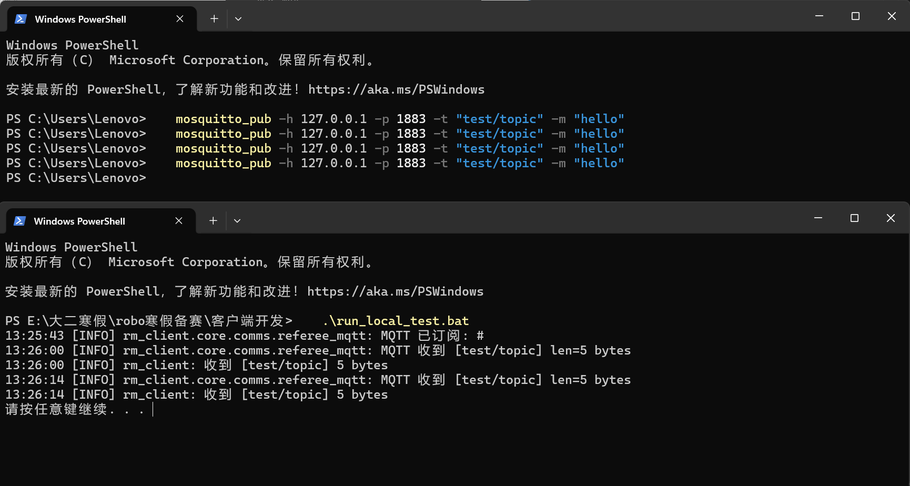
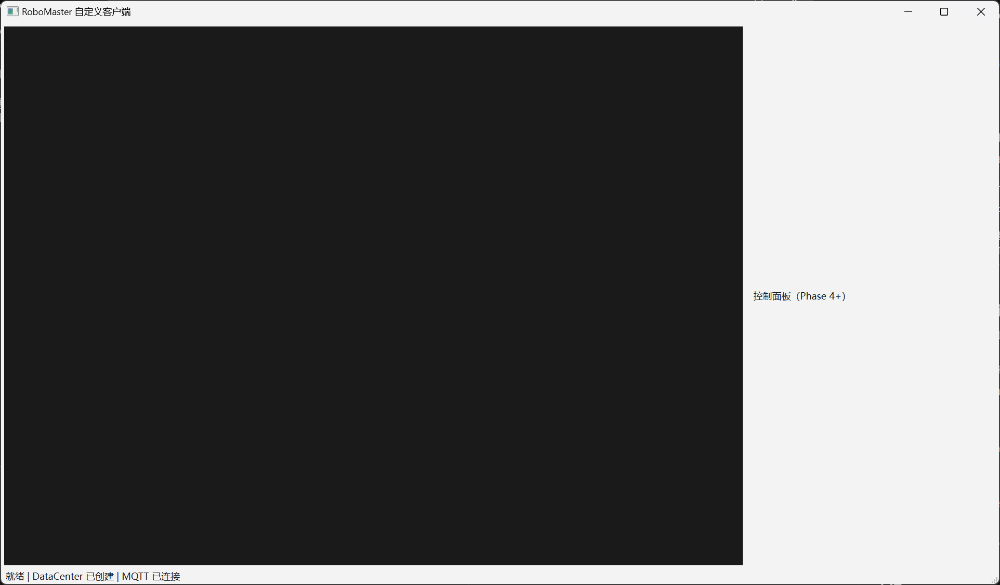
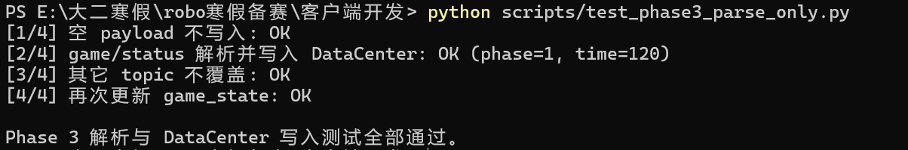
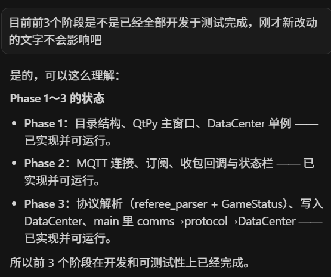
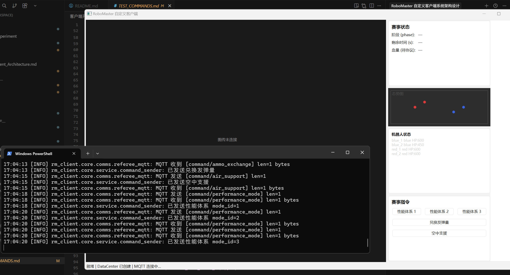
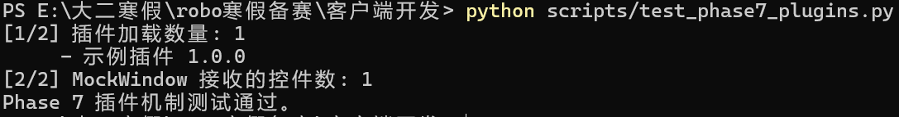
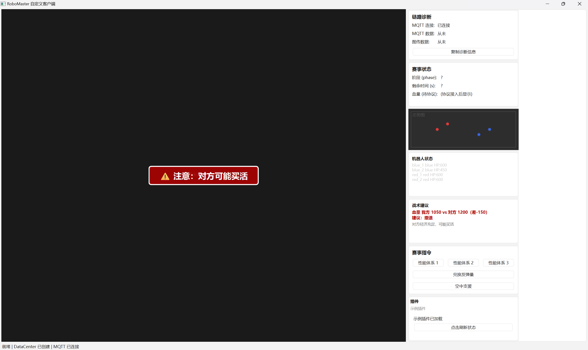

# RoboMaster 自定义客户端 — 测试报告

> 本报告依据各阶段开发完成后的测试截图整理，覆盖 Phase 2、Phase 4、Phase 7 的验收验证。
>

---

## 一、Phase 2 完成前测试（通信打通）

### 1.1 MQTT 订阅与收发

**测试步骤：**

1. 启动 mosquitto：`mosquitto -p 1883`
2. 运行 `run_local_test.bat` 启动客户端
3. 在另一终端执行：`mosquitto_pub -h 127.0.0.1 -p 1883 -t "test/topic" -m "hello"`

**测试结果：**

- 客户端成功订阅 Topic `#`
- 客户端收到 `[test/topic]` 消息，长度 5 bytes（"hello"）
- 多次发布均能正常接收

### 1.2 主窗口与 MQTT 连接状态

**测试结果：**

- 主窗口正常启动
- 控制面板（Phase 4+）区域可见
- 状态栏显示：`就绪 | DataCenter 已创建 | MQTT 已连接`

---

## 二、Phase 4 完成前测试（协议解析与 UI）

### 2.1 Phase 3 协议解析与 DataCenter 写入

**测试命令：** `python scripts/test_phase3_parse_only.py`

**测试结果：** 四项全部通过

| 序号 | 用例 | 结果 |
|------|------|------|
| 1/4 | 空 payload 不写入 | OK |
| 2/4 | game/status 解析并写入 DataCenter (phase=1, time=120) | OK |
| 3/4 | 其它 topic 不覆盖 | OK |
| 4/4 | 再次更新 game_state | OK |

### 2.2 Phase 1～3 完成确认

**结论：**

- Phase 1：目录结构、QtPy 主窗口、DataCenter 单例 —— 已实现并可运行
- Phase 2：MQTT 连接、订阅、收包回调与状态栏 —— 已实现并可运行
- Phase 3：协议解析（referee_parser + GameStatus）、写入 DataCenter、main 中 comms→protocol→DataCenter —— 已实现并可运行

---

## 三、Phase 7 完成前测试（态势、指令、插件）

### 3.1 主界面与赛事指令

**测试结果：**

- **赛事状态**：阶段、剩余时间、血量区域正常显示（待协议数据）
- **态势图**：红蓝双方机器人位置点正确渲染
- **机器人状态**：blue_1/2、red_1/2 及 HP 显示正常
- **赛事指令**：性能体系 1/2/3、兑换发弹量、空中支援按钮可点击

**指令发送验证（控制台日志）：**

- `已发送兑换发弹量`
- `MQTT 发送 [command/air_support] len=1`
- `已发送空中支援`
- `已发送性能体系 mode_id=1/2/3`

### 3.2 Phase 7 插件机制

**测试命令：** `python scripts/test_phase7_plugins.py`

**测试结果：**

- 插件加载数量：1
- 示例插件：1.0.0
- MockWindow 接收控件数：1
- **Phase 7 插件机制测试通过**

---

## 四、测试总结

| 阶段 | 测试项 | 结果 |
|------|--------|------|
| Phase 2 | MQTT 连接、订阅、收发 | 通过 |
| Phase 2 | 主窗口、DataCenter、状态栏 | 通过 |
| Phase 3 | 协议解析、DataCenter 写入 | 通过 |
| Phase 4～6 | 赛事状态、态势图、机器人状态、赛事指令 | 通过 |
| Phase 7 | 插件加载与挂载 | 通过 |

**结论：** Phase 1～7 核心功能均已实现并通过测试，满足当前阶段验收要求。

## 五、目前UI设计
结合了群里大家的讨论，目前的UI设计图长这样

经测试，各项功能使用没有问题。